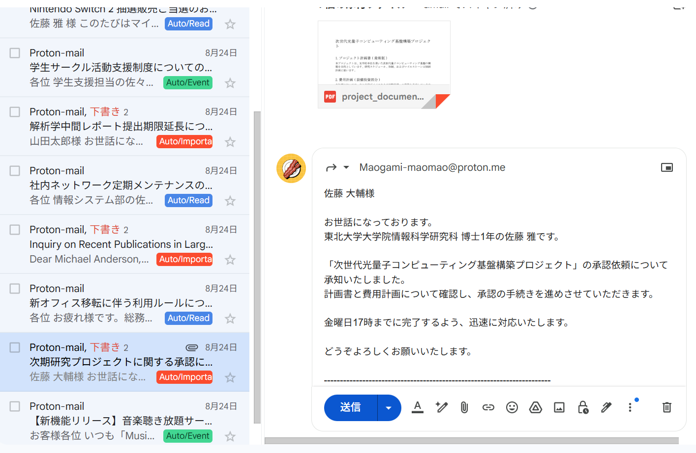

# Gmail Classification and Reply

Google Cloud Consorl (GCP)を用いて，Gmailの分類と返信の作成を自動で行うプログラム．

注意：このプログラムでは，メール本文をクラウド上のLLM(Gemini) に投げて分類しています．機密情報の取り扱いに注意してください．
実運用を想定する場合は，GPT-ossやllamaなどのローカルで動作するLLMを用いることを推奨します．

## 本リポジトリの構成
- HowtoUse
  - メール分類返信プログラムの実装方法を説明
- app
  - Dockerfile
  - requirements.txt
  - gmail_auth.py
  - gmail_vertex_classifier_with_reply_draft_read.py
- create_token.ipynb   

## 機能概要
* 10分おきに最新の未読メール10件を4種類の重要度に分類
  1. 返信対応が必要なメール
  2. 返信対応の必要はないが、重要度が高く，必ず読む必要があるメール
  3. 重要度が中程度で，目を通しておくべきメール
  4. 重要度が低く，読む必要がないメール
* 分類されたメールは、gmailのラベル機能でAuto/Importantのようなラベルを付与し，既読化
* 重要度1のメールは自動で返信文を生成し，下書きに保存
  * 敬語を使い100-200字程度
 
分類の判断基準や返信文の調整などは，gmail_vertex_classifier_with_reply_draft_read.pyにあるLLMへの命令文を変更することで調整可能です．　

メールの自動送信や，既読化の削除などは各自調整してください．

## デモ動画
https://github.com/user-attachments/assets/69fba6f1-9db2-4b73-a071-7b87c5f9f5da

## 更新情報
2025/08/21 公開

2025/09/16 Few-shotをプロンプトに導入し，分類精度と返信精度を向上させました．
